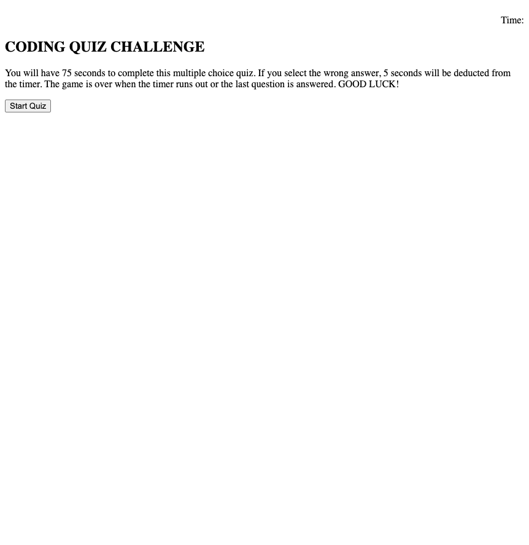

# 04-Web-APIs-Code-Quiz

This is a coding quiz built using JavaScript and HTML.

I updated the JavaScript code to meet the following acceptance criteria:

GIVEN I am taking a code quiz
WHEN I click the start button
THEN a timer starts and I am presented with a question
WHEN I answer a question
THEN I am presented with another question
WHEN I answer a question incorrectly
THEN time is subtracted from the clock
WHEN all questions are answered or the timer reaches 0
THEN the game is over
WHEN the game is over
THEN I can save my initials and my score

Please see [live page here](https://mattg-git.github.io/04-Web-APIs-Code-Quiz/) and screenshot of project below. 

